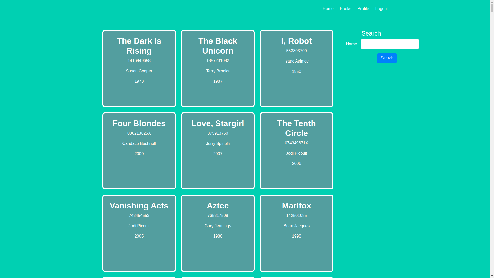
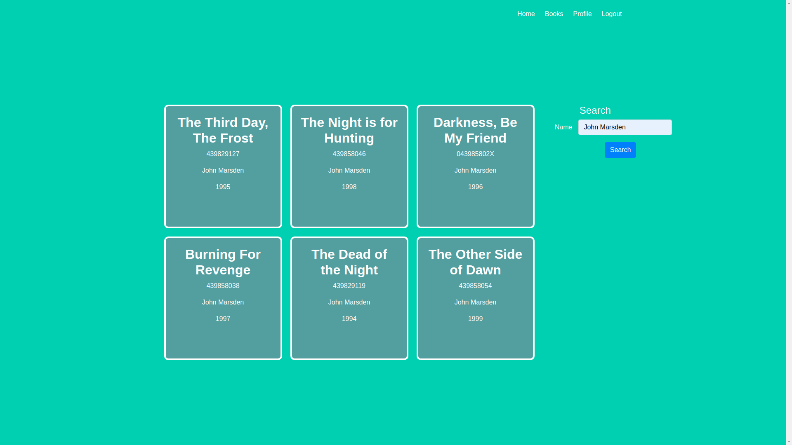
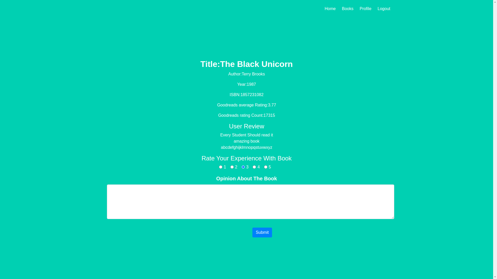
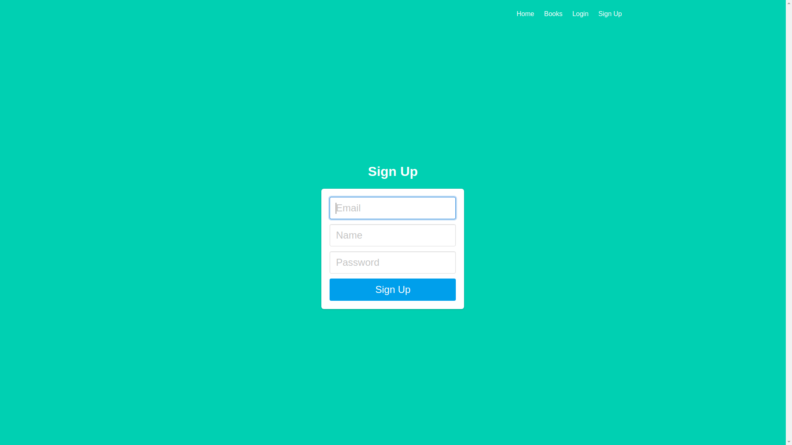

# Knowanybook

### A project of Harvard University Course

This project is part of web programming with python and javascript course by Harvard University. This project gives the user, detailed info about books and recent reviews, and users can give his/her rating to the book. Currently, this project has access to a 5000 book database. 
This project is made using **Flask Framework**.  To store book data, it uses **Heroku SQL Database**. It uses **Flaskwhooshalchemyplus** library for search functionality and **Goodreads Api** for fetching the latest rating of the book.

[Project Working Video](https://youtu.be/UkZo1XRx6V8)

### Portal Screenshots:

#BookListPage:

#AfterQuery:

#BookDetailPage:

#LoginPage:

#SignupPage:

